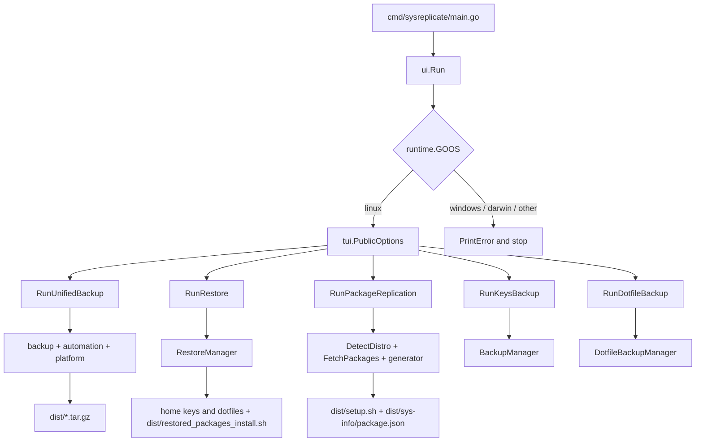
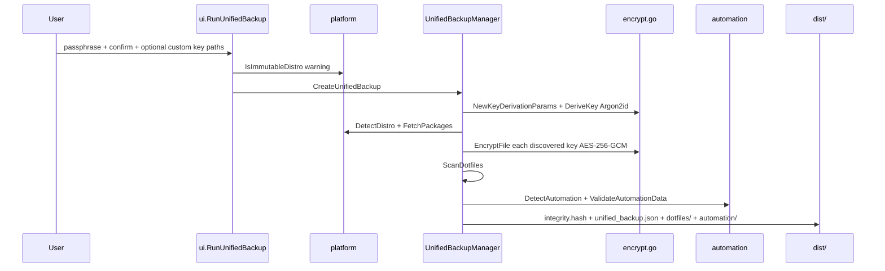
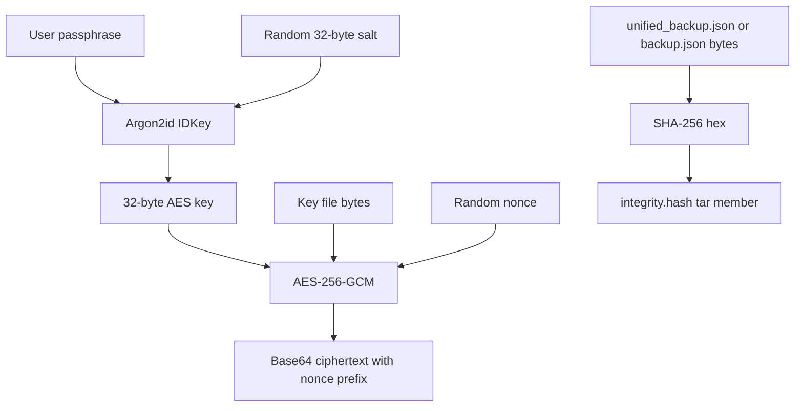
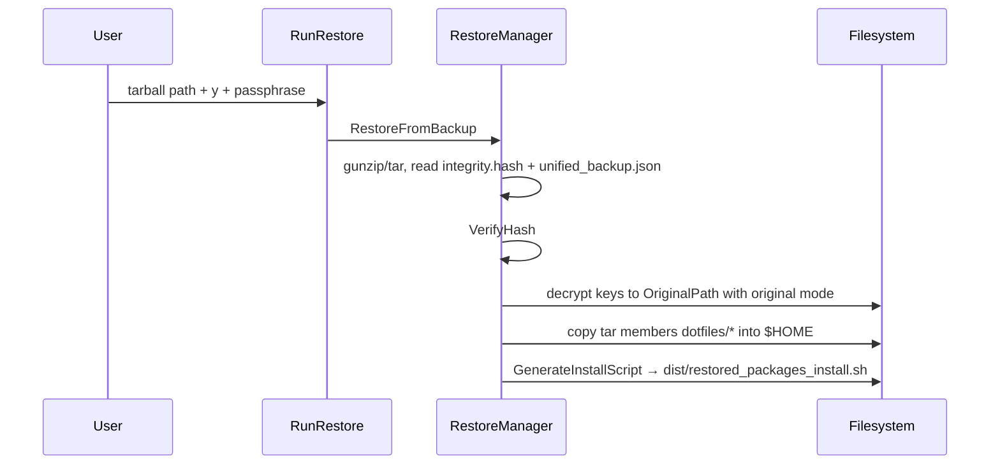

# SysReplicate (DistroHopper)

Linux system snapshot tool for people who hop distributions.

> SysReplicate is a **Linux-only, interactive TUI** that packs SSH/GPG keys, a fixed set of home-directory dotfiles, package inventories, and custom systemd/cron units into timestamped `.tar.gz` archives — then restores keys and dotfiles and emits a shell script for packages and automation. It is **not** a disk imager, not Timeshift/rsync, and not a full `/home` backup. The only supported runtime is Linux; macOS and Windows print an error and stop.

Primary interface: a Charmbracelet Bubble Tea menu launched from `cmd/sysreplicate/main.go`. There is no HTTP API, no CLI flag surface, and no configuration file.

---

**TL;DR**

- Five menu actions: unified backup, restore, package replication only, keys only, dotfiles only (`internal/ui/orchestrator.go`).
- Keys are encrypted with **AES-256-GCM**; the 32-byte key is derived from a user passphrase via **Argon2id** (`internal/core/backup/encrypt.go`). The passphrase is never stored.
- Unified and key-only archives carry a **SHA-256** `integrity.hash` of the JSON payload; restore refuses a mismatched hash.
- Distro detection reads `/etc/os-release` (then `/etc/lsb-release`, `/etc/issue`) and maps **20 IDs** onto **9 package families**, plus optional Flatpak/Snap (`internal/platform/distro.go`, `packages.go`).
- Immutable images (Silverblue, Kinoite, SteamOS, openSUSE MicroOS) get a warning; backup still runs (`platform.IsImmutableDistro`).
- Output always lands under `dist/` (gitignored). Restore overwrites files after an explicit `y`/`yes` confirmation.
- Go **1.25.0**, module `github.com/mdgspace/sysreplicate`. No tests, CI, Docker, or env-var config exist in this repo today.

## Contents

- [1. Vision](#1-vision)
- [2. Architecture](#2-architecture)
- [3. Quickstart](#3-quickstart)
- [4. Interactive menu](#4-interactive-menu)
- [5. Configuration](#5-configuration)
- [6. Directory map](#6-directory-map)
- [7. Backup formats and data models](#7-backup-formats-and-data-models)
- [8. Distro and package support](#8-distro-and-package-support)
- [9. Encryption and integrity](#9-encryption-and-integrity)
- [10. Restore lifecycle](#10-restore-lifecycle)
- [11. Security](#11-security)
- [12. Limitations](#12-limitations)
- [13. Testing](#13-testing)
- [14. Cookbook](#14-cookbook)
- [15. Roadmap and changelog](#15-roadmap-and-changelog)
- [16. FAQ](#16-faq)
- [17. Glossary](#17-glossary)
- [18. Contributing](#18-contributing)

## 1. Vision

### 1.1 What it is

A **portable identity-and-setup snapshot** for Linux: the pieces you usually re-create by hand after installing a new distro (keys, shell config, package lists, a handful of custom units). You run it on the source machine, copy a tarball, run it on the destination, then execute a generated install script.

### 1.2 What it is not

| Expectation | Reality |
|-------------|---------|
| Full disk / partition clone | No block-level copy, no `/`, no `/boot` |
| Complete home-directory backup | Only the paths in `domain.DotfilePaths`; `~/.config` is recorded as a directory and **not** recursively packed |
| Live package installer | Restore **writes a script**; you run it |
| Password manager / secret store | Passphrase is typed in the TUI and echoed by `bufio.Scanner` (not a hidden prompt) |
| Cross-OS tool | `runtime.GOOS` must be `linux` |
| Server daemon / API | Single interactive process |

### 1.3 Who it is for

Linux users who switch distributions (or reinstall the same one) and want a single tarball plus a generated package script — not people who need bare-metal disaster recovery.

## 2. Architecture

Layers point inward: `cmd` → `ui` → `core` / `platform` / `tui`. Domain types have no I/O.

```text
cmd/sysreplicate     entrypoint (calls ui.Run)
        │
internal/ui          OS gate + menu dispatch + stdin prompts
        │
   ┌────┼────────────────────┐
   │    │                    │
 tui   core/*            platform
 (Bubble Tea)            (os-release, package queries)
   │
   ├── backup     keys, dotfiles, unified archive, restore
   ├── automation systemd/cron detect + tar + restore commands
   └── generator  JSON metadata, install scripts, key/dotfile tarballs
   │
 domain            constants + JSON structs
 util              stderr logger (used by automation)
```



### 2.1 Request lifecycle (unified backup)



### 2.2 Package map

| Package | Path | Role |
|---------|------|------|
| Entrypoint | `cmd/sysreplicate/main.go` | `ui.Run()` |
| Orchestrator | `internal/ui/orchestrator.go` | OS check, five menu choices |
| Backup flows | `internal/ui/backup_integration.go` | Passphrase prompts, restore confirm, package-only path |
| TUI | `internal/tui/{tea,model,components,styles}.go` | Bubble Tea list; Lip Gloss styles |
| Unified backup | `internal/core/backup/unified_backup.go` | Combined snapshot |
| Restore | `internal/core/backup/restore.go` | Extract, hash check, decrypt keys, restore dotfiles, emit script |
| Keys | `internal/core/backup/key.go` | Key-only backup |
| Key discovery | `internal/core/backup/search.go` | `~/.ssh/`, `~/.gnupg/`, custom paths |
| Crypto | `internal/core/backup/encrypt.go` | Argon2id, AES-GCM, SHA-256 |
| Dotfiles | `internal/core/backup/dotfile_scanner.go`, `dotfiles_backup.go` | Scan + key-less tarball |
| Automation | `internal/core/automation/{automation,scanner,backup,restore}.go` | Detect, pack, generate `cp`/`systemctl`/`crontab` lines |
| Generator | `internal/core/generator/{scripts,metadata,archive}.go` | Install scripts and smaller archives |
| Platform | `internal/platform/{distro,packages}.go` | ID mapping and package queries |
| Domain | `internal/domain/{constants,metadata,automation}.go` | Paths, commands, structs |
| Logging | `internal/util/logging.go` | Debug/Info/Warn/Error to stderr |

## 3. Quickstart

### 3.1 Prerequisites

| Requirement | Notes |
|-------------|--------|
| Linux | macOS/Windows are rejected in `ui.Run` |
| Go 1.25.0+ | `go.mod` `go 1.25.0` |
| Shell tools used at backup time | Distro-native query commands (`dpkg-query`, `pacman`, `rpm`, …) plus optional `flatpak` / `snap` |
| Root on restore (packages/automation) | Generated scripts use `sudo`; key/dotfile restore writes into `$HOME` as the current user |

### 3.2 Build and run

```bash
git clone https://github.com/mdgspace/sysreplicate.git
cd sysreplicate
go run ./cmd/sysreplicate
```

Or install a binary in the working directory:

```bash
go build -o sysreplicate ./cmd/sysreplicate
./sysreplicate
```

The old README’s `go run main.go` / `go build -o sysreplicate main.go` paths are **wrong** on current `main`: there is no root `main.go`.

### 3.3 First successful backup

1. Run the binary on Linux.
2. Choose **Create Complete System Backup (Recommended)**.
3. Enter and confirm a passphrase you can remember (it cannot be recovered from the archive).
4. Optionally add extra key directories; press Enter on an empty `Path:` to skip.
5. Copy `dist/unified-backup-YYYY-MM-DD-HH-MM-SS.tar.gz` off the machine.

### 3.4 First restore (new install)

1. Install Go (or copy a pre-built binary), clone or copy this repo, place the tarball somewhere readable.
2. Run SysReplicate → **Restore System from Backup** → paste the tarball path → `y` → passphrase.
3. Run the generated package script (see [§10](#10-restore-lifecycle)):

```bash
chmod +x dist/restored_packages_install.sh
./dist/restored_packages_install.sh
```

## 4. Interactive menu

`tui.PublicOptions` presents the five strings in `ui.string_list`. Keys: `↑`/`k`, `↓`/`j`, Enter or Space to select, `q` or Ctrl+C to quit (selected index 6, which is not mapped and prints “Invalid choice”).

| # | Label | Handler | Writes |
|---|--------|---------|--------|
| 1 | Create Complete System Backup (Recommended) | `RunUnifiedBackup` | `dist/unified-backup-<timestamp>.tar.gz` |
| 2 | Restore System from Backup | `RunRestore` | Keys + dotfiles in place; `dist/restored_packages_install.sh` |
| 3 | Generate package replication files only | `RunPackageReplication` | `dist/sys-info/package.json`, `dist/setup.sh` |
| 4 | Backup SSH/GPG keys only | `RunKeysBackup` | `dist/key-backup-<timestamp>.tar.gz` |
| 5 | Backup dotfiles only | `RunDotfileBackup` | `dist/dotfile-backup.tar.gz` (fixed name, overwritten) |

There is **no** sixth “Exit” menu row; quit is `q`.

### 4.1 What each action actually does

**Unified backup** — passphrase (confirmed) → optional custom key paths → immutable-distro warning if applicable → encrypt keys, scan dotfiles, detect automation, fetch packages → one gzip tarball.

**Restore** — path must exist and be a file → overwrite warning → passphrase → integrity check → decrypt keys to `OriginalPath` → extract `dotfiles/` into `$HOME` → generate install script. Automation files are **not** copied onto the system during this step; they only appear as commands inside the script, which assume an extracted `automation/` tree (see [§12](#12-limitations)).

**Package replication** — `DetectDistro` + `FetchPackages` → JSON + `setup.sh`. No keys, no passphrase.

**Keys only** — same crypto as unified; archive contains `integrity.hash` + `backup.json` only.

**Dotfiles only** — no encryption, no integrity hash; `backup.json` plus file blobs named by `RealPath`.

## 5. Configuration

There is **no** `.env`, config file, or CLI flags. Behaviour is compile-time constants in `internal/domain/constants.go` and path lists in the same package.

### 5.1 Output paths

| Constant | Value |
|----------|--------|
| `OutputScriptsDirPath` | `dist` |
| `OutputSysDirPath` | `dist/sys-info` |
| `JsonOutputPath` | `dist/sys-info/package.json` |
| `ScriptOutputPath` | `dist/setup.sh` |
| `RestoreScriptPath` | `dist/restored_packages_install.sh` |
| `DotfileOutputPath` | `dist/dotfile-backup.tar.gz` |
| `UnifiedTarballBasePath` | `dist/unified-backup-%s.tar.gz` (`time.Now()` as `2006-01-02-15-04-05`) |

Key-only archives use a hard-coded format in `key.go`: `dist/key-backup-%s.tar.gz`.

### 5.2 Host paths the tool reads

| Constant | Value | Used for |
|----------|--------|----------|
| `OsReleasePath` | `/etc/os-release` | Distro ID (`readOSRelease` also tries `/etc/lsb-release`, `/etc/issue`) |
| `SystemdDirPath` | `/etc/systemd/system` | Custom units |
| `UserCronTemplatePath` | `/var/spool/cron/crontabs/%s` | User crontab (`USER` / `USERNAME`) |
| `SystemCrontabDefaultPath` | `/etc/crontab` | System crontab |
| `CronDDirPath` | `/etc/cron.d` | Drop-in cron files |

### 5.3 Dotfile scan list (`domain.DotfilePaths`)

`~/.bashrc`, `~/.zshrc`, `~/.vimrc`, `~/.config`, `~/.bash_history`, `~/.zsh_history`, `~/.gitconfig`, `~/.profile`, `~/.npmrc`.

`ScanDotfiles` does **not** walk directories. If `~/.config` exists, it is stored as `IsDir: true` and skipped when packing the unified tarball.

### 5.4 Key discovery

Standard directories: `~/.ssh/`, `~/.gnupg/`.

Filename heuristics (`SshPatterns`, `GpgPatterns`, plus suffixes `.pub` / `.pem` / `.key`):

- SSH: `id_rsa`, `id_dsa`, `id_ecdsa`, `id_ed25519`, `authorized_keys`, `known_hosts`, `config`
- GPG (legacy names): `pubring.gpg`, `secring.gpg`, `trustdb.gpg`, `gpg.conf`, `gpg-agent.conf`

Modern GnuPG `pubring.kbx` / `private-keys-v1.d` are **not** in the pattern list unless a filename happens to match `.key` / `.pem` / `.pub`.

### 5.5 Argon2id parameters (not user-tunable)

| Parameter | Value | Constant |
|-----------|--------|----------|
| Time | 3 | `argonTime` |
| Memory | 64 MiB (`64 * 1024` KiB) | `argonMemory` |
| Threads | 4 | `argonThreads` |
| Salt | 32 random bytes | `saltLen` |
| Output key | 32 bytes | AES-256 |

Parameters are serialized into the archive as `key_derivation_params` so restore can re-derive the same key.

### 5.6 Logger

`automation.Log` is `util.NewLogger(util.InfoLevel)` → stderr with `log.LstdFlags`. There is no env var to raise it to Debug.

## 6. Directory map

```text
sysreplicate/
├── cmd/sysreplicate/main.go          # main
├── go.mod / go.sum                   # module github.com/mdgspace/sysreplicate
├── README.md
├── .gitignore                        # dist/, testing/*
├── dist/                             # created at runtime, not committed
└── internal/
    ├── ui/
    │   ├── orchestrator.go           # OS gate + menu
    │   └── backup_integration.go     # five handlers
    ├── tui/
    │   ├── tea.go                    # Bubble Tea Init/Update/View
    │   ├── model.go                  # PublicOptions
    │   ├── components.go
    │   └── styles.go                 # Lip Gloss
    ├── core/
    │   ├── backup/                   # 7 files: unified, restore, keys, crypto, scan
    │   ├── automation/               # detect, pack, validate, restore commands
    │   └── generator/                # scripts, metadata JSON, key/dotfile tarballs
    ├── platform/
    │   ├── distro.go                 # ID map, ID_LIKE, immutable check
    │   └── packages.go               # fetch commands + flatpak/snap
    ├── domain/
    │   ├── constants.go
    │   ├── metadata.go
    │   └── automation.go
    └── util/logging.go
```

**27** Go source files. No `_test.go`, no `.github/workflows`, no Dockerfile, no LICENSE file.

## 7. Backup formats and data models

### 7.1 Unified archive (`unified-backup-*.tar.gz`)

| Member | Contents |
|--------|----------|
| `integrity.hash` | Hex SHA-256 of the **exact bytes** of `unified_backup.json` |
| `unified_backup.json` | `UnifiedBackupData` (see below) |
| `dotfiles/<RealPath>` | Non-directory, non-binary files from the scan |
| `automation/systemd/<basename>` | Custom `.service` / `.timer` / `.target` bodies |
| `automation/cron/<basename>` | User/system/`cron.d` crontab files |

JSON shape (`UnifiedBackupData` in `unified_backup.go`):

| Field | Type | Notes |
|-------|------|--------|
| `timestamp` | RFC JSON time | Backup time |
| `system_info` | `hostname`, `username`, `os` (`linux`) | Distro IDs are sibling fields, not inside this struct on unified backups |
| `encrypted_keys` | map of `EncryptedKey` | AES-GCM ciphertext, base64 |
| `dotfiles` | `[]Dotfile` | Metadata; file bytes also live as tar members |
| `packages` | `map[string][]string` | Keys such as `official_packages`, `yay_packages`, `flatpak_packages`, `snap_packages` |
| `automation` | `AutomationData` | Four slices of units/cron |
| `distro` / `base_distro` | string | From `DetectDistro` |
| `key_derivation_params` | salt + Argon2 costs | Required for restore |

`EncryptedKey`: `original_path`, `key_type` (`ssh` / `gpg` / `custom`), `encrypted_data`, `permissions`.

### 7.2 Key-only archive (`key-backup-*.tar.gz`)

| Member | Contents |
|--------|----------|
| `integrity.hash` | SHA-256 of `backup.json` |
| `backup.json` | `domain.BackupData` (`timestamp`, `system_info`, `encrypted_keys`, `key_derivation_params`) |

There is **no** restore menu path for this format. `RestoreFromBackup` looks for `unified_backup.json`. Key-only tarballs are storage, not currently re-ingested by the TUI.

### 7.3 Dotfile-only archive (`dotfile-backup.tar.gz`)

| Member | Contents |
|--------|----------|
| `backup.json` | `BackupMetadata` (`timestamp`, `hostname`, `files`) |
| `<RealPath>` | File contents (directories skipped) |

No `integrity.hash`. No restore path in the TUI.

### 7.4 Package-only outputs

`dist/sys-info/package.json`:

```json
{
  "os": "linux",
  "distro": "<ID>",
  "base_distro": "<family>",
  "packages": { "official_packages": ["..."], "flatpak_packages": ["..."] }
}
```

`dist/setup.sh`: bash, `set -e`, per-package install lines with `|| true`.

## 8. Distro and package support

### 8.1 Detection

`DetectDistro` (`internal/platform/distro.go`):

1. Read first existing file among `/etc/os-release`, `/etc/lsb-release`, `/etc/issue`.
2. Parse `ID=` and `ID_LIKE=` (whitespace-split).
3. Walk candidates through `knownDistros`; first hit wins as `base_distro`.
4. Unknown → `("unknown", "unknown")` or a known `ID` with `base_distro` `"unknown"`.

### 8.2 `knownDistros` (20 IDs → 9 families)

| `ID` / alias | Base family | Native fetch | Native install line |
|--------------|-------------|--------------|---------------------|
| debian, ubuntu, linuxmint, pop | `debian` | `dpkg-query` + `apt-mark showmanual` | `sudo apt-get install -y` |
| arch, manjaro, endeavouros | `arch` | `pacman -Qen` / `pacman -Qem` (AUR) | `sudo pacman -S --noconfirm` + `yay` for AUR |
| rhel, centos, rocky, alma | `rhel` | `rpm -qa` | `sudo dnf install -y` |
| fedora | `fedora` | same as rhel | same as rhel |
| void | `void` | `xbps-query -l` | `sudo xbps-install -y` |
| opensuse, opensuse-leap, opensuse-tumbleweed, suse | `opensuse` | `zypper search --installed-only` | `sudo zypper install -y` |
| alpine | `alpine` | `apk info -v` | `sudo apk add` |
| nixos | `nixos` | `nix-env -q` | `nix-env -iA nixpkgs.<pkg>` |
| gentoo | `gentoo` | `ls /var/db/pkg/*/* \| xargs -n1 basename` | `sudo emerge -q` |

`FetchPackages` uses one `switch` on `base_distro`; `rhel` and `fedora` share the rpm/dnf commands. An unrecognized family logs “Unsupported distro…” and still attaches Flatpak/Snap probes.

### 8.3 Optional managers

If `flatpak` / `snap` are on `PATH`, extra keys `flatpak_packages` and `snap_packages` are filled; otherwise the map still contains those keys from a no-op `true` command (often a single empty string after split).

Install script: install `flatpak` or `snapd` via the native command if missing; Snap enable uses `systemctl` (comment in `scripts.go` notes non-systemd hosts are unsupported for that path).

### 8.4 Immutable distros

`IsImmutableDistro` is true when:

- `VARIANT_ID` is `silverblue` or `kinoite`, or
- `ID` contains `steamos`, or
- `ID` contains `opensuse-microos`.

Unified backup **prints a warning** that `rpm-ostree` / `transactional-update` must be used by hand. It does not change fetch/install command generation.

### 8.5 NixOS caveat

Package restore uses `nix-env`, not `configuration.nix` / flakes. That is a user-profile install, not a declarative system rebuild.

## 9. Encryption and integrity



### 9.1 What is encrypted

Only files classified as keys. Dotfiles, package lists, and automation unit text are **plaintext** in the archive.

### 9.2 Integrity

`HashPayload` / `VerifyHash` in `encrypt.go`. If `integrity.hash` is present and does not match, restore returns `integrity check failed: backup data may be corrupted or tampered`. If the hash member is missing, verification is skipped (older or partial archives).

### 9.3 Breaking change vs older backups

PR #29 removed storing a raw `EncryptionKey` in JSON. Current restore **requires** `key_derivation_params`. Archives produced with random keys and no passphrase **cannot** be opened by this tree.

## 10. Restore lifecycle



### 10.1 What restore applies immediately

- SSH/GPG (and custom) key files, creating parent directories at `0755`, writing with archived `permissions`.
- Dotfiles whose tar names start with `dotfiles/`, joined onto `os.UserHomeDir()`.

Wrong passphrase typically surfaces as GCM authentication failure per key (`failed to decrypt`), not a single hard abort — restore continues and may restore zero keys.

### 10.2 What restore only scripts

`GenerateInstallScript` (`internal/core/generator/scripts.go`) plus `GenerateRestorationCommands` (`internal/core/automation/restore.go`):

- Per-package native / yay / flatpak / snap lines (`|| true` so one missing package does not stop the script; the header still has `set -e`).
- `sudo cp automation/systemd/<file> <original path>`
- `sudo systemctl daemon-reload` then `enable --now` for services and timers
- `crontab automation/cron/<basename>` for user crontabs
- `sudo cp` for `/etc/crontab` and `/etc/cron.d/*`

Those `automation/…` paths are **relative to the working directory when the script runs**. Restore does not extract the tarball into `./automation/`. Until that is fixed (TODO in `restore.go`), package install from the script can work, but automation `cp` lines fail unless you extract the archive yourself first.

### 10.3 Systemd status fields

`getSystemDUnitStatus` is a stub: `IsEnabled` and `IsActive` are always `false`. Restore still emits `systemctl enable --now` for every custom `.service` / `.timer` found at backup time, not only units that were enabled on the source.

### 10.4 Custom vs packaged units

A unit under `/etc/systemd/system` is skipped if it is a symlink into `/usr/lib/systemd/system/`, `/lib/systemd/system/`, or `/usr/share/systemd/` (`domain.PackageManagedDirs`). Regular files (and symlinks pointing elsewhere) are treated as custom.

## 11. Security

| Topic | Behaviour |
|-------|-----------|
| Key confidentiality | AES-256-GCM; key from Argon2id(passphrase, per-archive salt) |
| Passphrase storage | Not written to disk; must be remembered |
| Passphrase entry | Visible stdin (`bufio.Scanner`); not a masked password field |
| Archive at rest | Keys ciphertext; everything else plaintext — treat tarballs as sensitive |
| Integrity | SHA-256 of JSON, not HMAC (detects accidental corruption; a tamperer who can rewrite both members can still swap content) |
| Overwrite | Restore requires `y`/`yes`; then overwrites destinations |
| Privilege | Binary itself does not escalate; generated scripts use `sudo` |
| Secrets in git | `dist/` is gitignored; do not force-add it |

**Operational advice:** copy archives over a trusted channel; keep the passphrase out of shell history if you wrap the tool later; rotate SSH keys if an archive is leaked (ciphertext is only as strong as the passphrase).

## 12. Limitations

- Linux only.
- Not a full home or system backup; binary files in the dotfile list are skipped (`containsNullByte`).
- `~/.config` is not recursively archived.
- GPG keybox layout (`*.kbx`, `private-keys-v1.d`) is largely missed by current filename patterns.
- Key-only and dotfile-only archives have no TUI restore.
- Cross-distro package restore will fail for names that do not exist in the target repos; scripts use `|| true`.
- Debian fetch keeps **manually marked** packages (`apt-mark showmanual` ∩ installed), not every `dpkg` package.
- Automation restore commands are generated, not executed, and assume extracted tar paths.
- Snap restore assumes systemd (`snapd.socket`).
- NixOS / Gentoo / immutable Fedora variants need manual, distro-idiomatic install after the script.
- No tests or CI in-tree.
- `go.mod` lists Bubble Tea / Lip Gloss / `x/crypto` as `// indirect` even though `internal/tui` and `encrypt.go` import them.

## 13. Testing

There are **zero** `*_test.go` files. Validation today is manual:

```bash
go build -o sysreplicate ./cmd/sysreplicate
# on Linux:
./sysreplicate
```

Useful extra checks (not wired in CI): `gofmt`, `go vet ./...`, running unified backup then restore on a disposable VM.

`testing/` is gitignored; nothing in-repo documents a harness there.

## 14. Cookbook

### 14.1 Hop from Ubuntu to Fedora

On Ubuntu:

1. Menu 1 → passphrase → empty custom paths.
2. Copy `dist/unified-backup-*.tar.gz` to external storage.

On a fresh Fedora install (after creating the same username if you want key paths to match):

1. Build/run SysReplicate, menu 2, point at the tarball.
2. Confirm keys exist: `ls -l ~/.ssh`, `ssh-add -l`.
3. Run `dist/restored_packages_install.sh`. Expect some `dnf` failures for Debian-only package names; install Fedora equivalents by hand.
4. `source ~/.bashrc` or reopen the terminal.

### 14.2 Package list only (no secrets)

Menu 3. Inspect `dist/sys-info/package.json`, edit `dist/setup.sh` before running it on another machine with the **same** base family.

### 14.3 Keys for a new laptop, same distro

Menu 4, then copy `dist/key-backup-*.tar.gz` somewhere encrypted (LUKS stick, etc.). Restore currently requires a **unified** archive — for key-only tarballs, extract `backup.json` only if you write your own decrypt helper, or use unified backup instead.

### 14.4 Immutable Silverblue-style host

Menu 1 still runs. Read the warning. Do **not** expect `dnf install` from the generated script to layer packages; use `rpm-ostree install` (or the distro’s transactional tool) with a curated subset of names from the JSON.

### 14.5 Inspect a unified archive without restore

```bash
tar -tzf dist/unified-backup-YYYY-MM-DD-HH-MM-SS.tar.gz
tar -xOf dist/unified-backup-YYYY-MM-DD-HH-MM-SS.tar.gz unified_backup.json | less
```

Do not assume `encrypted_data` fields are safe to share; they are still secret material under a passphrase.

## 15. Roadmap and changelog

### 15.1 Build phases (completed)

| Phase | Theme | Status |
|-------|--------|--------|
| 0 | Interactive Linux tool, package lists for Debian/Arch/RHEL/Void + Flatpak/Snap | ✅ |
| 1 | AES-GCM key backup and tarball output | ✅ |
| 2 | Dotfile scan + unified backup/restore | ✅ |
| 3 | Custom systemd units and cron detection + scripted restore commands | ✅ |
| 4 | Layout migration to `cmd/` + `internal/{ui,tui,core,platform,domain}` | ✅ |
| 5 | Passphrase Argon2id KDF, drop stored raw keys, SHA-256 `integrity.hash` | ✅ |
| 6 | openSUSE, Alpine, NixOS, Gentoo fetch/install; `ID_LIKE` parsing; immutable warning | ✅ |

### 15.2 Possible future directions

(Honest gaps in current code — not a commitment.)

- Masked passphrase prompt (`term.ReadPassword`).
- Recurse `~/.config` with an exclude list; pack binaries or skip with a log.
- Discover GnuPG `private-keys-v1.d` / `pubring.kbx`.
- Extract `automation/` next to the install script during restore (the TODO in `restore.go`).
- Restore path for key-only and dotfile-only archives.
- `systemctl is-enabled` / `is-active` instead of stubbed status.
- Tests for distro mapping, KDF round-trip, and tar round-trip.
- `go.mod` direct requires + CI (`go test`, `go vet`).
- Non-systemd Snap/cron handling.

### 15.3 Changelog (repo history, recent `main`)

| Date / merge | What landed |
|--------------|-------------|
| 2026-08 (PR #30) | Distro expansion: openSUSE, Alpine, NixOS, Gentoo; `ID_LIKE` + fallback files; immutable distro warning |
| 2026-08 (PR #29) | Argon2id passphrase KDF; SHA-256 integrity member; no `GenerateKey` / plaintext key in JSON |
| 2026-08 (#28) | Systemd unit panic, fd leak, key discovery abort |
| 2026-08 (PR #27) | Logging abstraction; TUI errors instead of `os.Exit`; domain struct dedup; dead code removal |
| Earlier | `cmd/sysreplicate` split; `internal/core` backup/automation/platform moves; unified backup; encryption; dotfiles; Flatpak/Snap |

## 16. FAQ

**Why did `go run main.go` fail?**  
The module entrypoint is `./cmd/sysreplicate`. See [§3](#3-quickstart).

**Can I run this on Windows to back up a WSL install?**  
The Windows binary exits immediately. Run it *inside* the Linux environment you want to snapshot.

**I forgot the passphrase.**  
Keys cannot be decrypted. Dotfiles and package lists in a unified archive are still readable with `tar`.

**Does restore merge or replace dotfiles?**  
Replace. Matching paths under `$HOME` are overwritten.

**Will every Ubuntu package install on Arch?**  
No. The script replays names with the **target** family’s installer using the **source** list.

**Why is `~/.config` empty after restore?**  
It was never packed as a tree. Only the explicit files in `DotfilePaths` that are not directories/binaries go into `dotfiles/`.

**Why did GPG not come back?**  
Discovery looks for legacy `pubring.gpg` / `secring.gpg` names, not a full `~/.gnupg` copy.

**Is the encryption key in the tarball?**  
No. Salt and Argon2 parameters are. The key is derived at restore time from your passphrase.

## 17. Glossary

| Term | Meaning here |
|------|----------------|
| Base distro | Package-family key (`debian`, `arch`, `rhel`, …) used to pick fetch/install commands |
| Unified backup | Single tarball of keys + dotfiles + packages + automation metadata/files |
| Custom systemd unit | File under `/etc/systemd/system` that is not a symlink into package-managed dirs |
| Distro hopper | User installing a different (or clean) Linux distribution and wanting old setup back |
| Integrity hash | SHA-256 of the JSON payload stored as `integrity.hash` |
| KDF | Key derivation function — Argon2id in this project |

## 18. Contributing

Repository: [github.com/mdgspace/sysreplicate](https://github.com/mdgspace/sysreplicate) (Mobile Development Group).

No `CONTRIBUTING.md` or `LICENSE` is present on `main`. Practical bar for a change:

1. Keep Linux-only behaviour unless you add a new `runtime.GOOS` branch on purpose.
2. Do not commit `dist/` or secrets.
3. Match existing layout: domain types in `internal/domain`, I/O in `internal/core` / `internal/platform`, user interaction in `internal/ui` + `internal/tui`.
4. If you change archive JSON, document compatibility in [§9.3](#93-breaking-change-vs-older-backups) and the changelog.

```bash
gofmt -w .
go build -o sysreplicate ./cmd/sysreplicate
```
