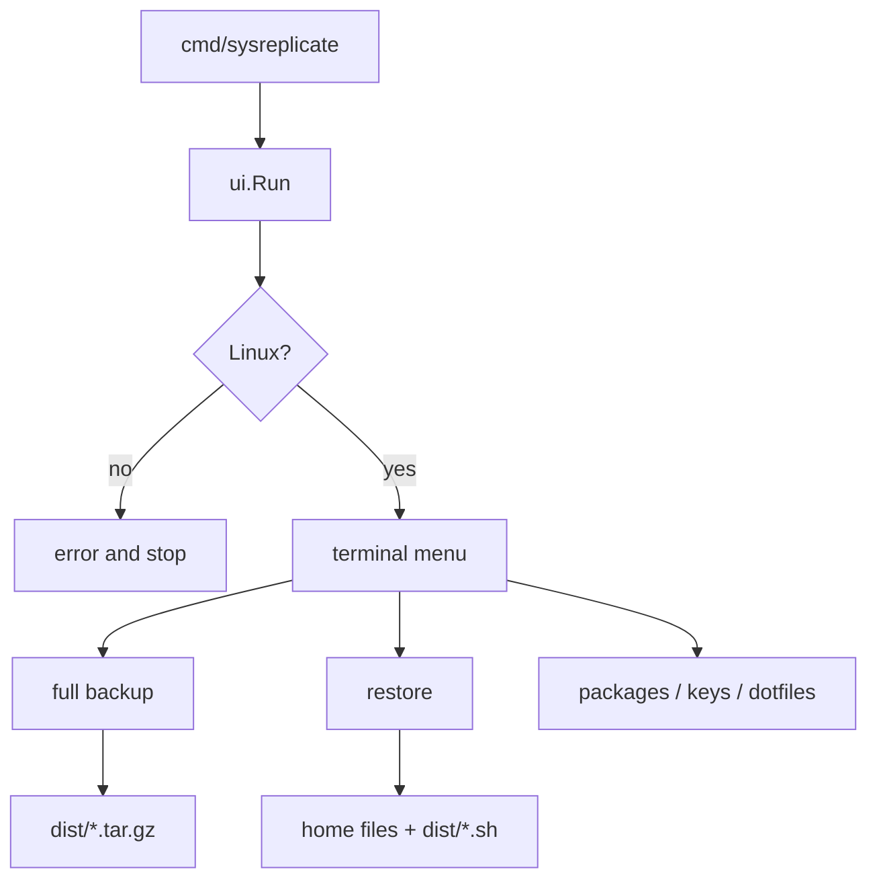

# SysReplicate — Linux setup snapshot for distro hoppers

A small Go program for people who reinstall or switch Linux distributions and want their keys, a few config files, package lists, and homemade services in one archive.

> **SysReplicate is a Linux-only setup snapshot.** It is not a disk clone, not Timeshift, and not a full home-folder backup. You pick an action from a terminal menu (`cmd/sysreplicate/main.go`). There is no website, no flags, and no config file. If Flatpak or Snap is missing, those extra package lists are skipped.

Runtime: Go 1.25.0, Linux only. macOS and Windows print an error and stop.

---

## TL;DR

- Five menu choices: full backup, restore, packages only, keys only, dotfiles only.
- Private keys are locked with a **passphrase** (the secret you type). That passphrase is never saved in the archive.
- Restore puts keys and config files back, then **writes a shell script** for packages. It does not install packages for you.
- Linux flavours are grouped into **9 families** (Debian-like, Arch-like, and so on) so Ubuntu and Mint both use `apt`.
- Output goes to `dist/` (gitignored). Overwriting files needs a `y`.
- **27** Go files. No tests or CI in this repo today.

## Table of contents

- [1. Vision](#1-vision)
- [2. Ideas worth understanding](#2-ideas-worth-understanding)
- [3. Architecture](#3-architecture)
- [4. Quickstart](#4-quickstart)
- [5. Configuration](#5-configuration)
- [6. Directory tree](#6-directory-tree)
- [7. Interfaces](#7-interfaces)
- [8. Data model](#8-data-model)
- [9. Testing](#9-testing)
- [10. Further reading](#10-further-reading)
- [11. Roadmap and changelog](#11-roadmap-and-changelog)
- [12. Future advancements](#12-future-advancements)
- [13. FAQ](#13-faq)
- [14. Glossary](#14-glossary)

## 1. Vision

### 1.1 What it is

The handful of things you usually rebuild by hand after a new install: SSH/GPG keys, a short list of shell/git files, “what packages did I have?”, and services you wrote yourself. Run it on the old machine, copy a `.tar.gz`, run it on the new one, then run the generated install script.

### 1.2 What it is not

| You might expect | What you get |
|------------------|--------------|
| Clone of the whole disk | Only the pieces above |
| All of `~/.config` | A fixed file list; `~/.config` is **not** walked |
| Packages installed automatically | A script you run yourself |
| Hidden password prompt | The passphrase is echoed as you type |
| Windows / macOS | Linux only |

### 1.3 Who it is for

People hopping distros (or reinstalling the same one). Not a backup product for “my laptop died and I need the last three years of photos.”

## 2. Ideas worth understanding

These are the design bets, not the menu labels. Details of files and formats are in [§7](#7-interfaces) and [§8](#8-data-model).

### 2.1 Derive the lock; never ship the key

**Constraint.** An archive full of SSH private keys cannot also contain the lock’s combination in plain text. An older version did that (a random key stored in JSON). Anyone with the tarball could open it.

**How it works.** You type a passphrase. The program turns that into an encryption key using **Argon2id** — a slow, memory-hungry function so guessing passwords is expensive. Only a random salt and the cost settings are stored. Restore types the same passphrase and rebuilds the same key. Code: `internal/core/backup/encrypt.go`.

**Analogy.** A hotel safe: the combination stays in your head. The safe only records which lock model it is.

**Limits.** A weak passphrase is still weak. Typing is visible on screen. Archives from before this change cannot be opened.

**Read next.** [Argon2 (Wikipedia)](https://en.wikipedia.org/wiki/Argon2) — why it is slow on purpose. [RFC 9106](https://www.rfc-editor.org/rfc/rfc9106.html) if you want the spec.

### 2.2 Lock the secrets; barcode the packing list

**Constraint.** Keys must stay secret *and* untampered. Package lists and shell configs are left readable so you can `tar` them and look. The JSON packing list still needs a cheap “did this file get corrupted?” check.

**How it works.** Key files are encrypted with **AES-GCM** (encrypt plus a tamper tag in one step). The packing list gets a **SHA-256** fingerprint saved as `integrity.hash`. Restore refuses a mismatch. The fingerprint covers the JSON only, not every file in the tarball. Code: `encrypt.go`, `unified_backup.go`, `restore.go`.

**Analogy.** A locked cash envelope plus a barcode on the packing list. The barcode catches a smudge in transit. It does not stop someone who reprints both the list and the barcode.

**Limits.** SHA-256 here is a checksum, not a keyed stamp. Dotfile-only archives have no fingerprint. If the hash file is missing, the check is skipped.

**Read next.** [Galois/Counter Mode (Wikipedia)](https://en.wikipedia.org/wiki/Galois/Counter_Mode) — encrypt and authenticate together. [SHA-2 (Wikipedia)](https://en.wikipedia.org/wiki/SHA-2) — what a fingerprint is.

### 2.3 Map to a family, not a clone

**Constraint.** There are dozens of Linux names (Pop, Endeavour, Rocky). Teaching the program a unique install command for each one does not scale. Pop!_OS should still use `apt`.

**How it works.** It reads `/etc/os-release`, then a fallback list (`ID_LIKE`). Twenty names collapse to **nine families**. Ubuntu and Mint both become `debian`. Install scripts use the **family** command, not the pretty name. Code: `internal/platform/distro.go`.

**Analogy.** Airline alliances: you follow the alliance boarding rules, not a unique ritual per paint job.

**Limits.** Package **names** are not translated. Ubuntu names on Fedora will fail (the script continues). Silverblue-style systems (read-only OS, updates like Git for binaries) get a warning; the script is still ordinary `dnf`/`apt`. See [OSTree](https://en.wikipedia.org/wiki/OSTree).

**Read next.** [os-release(5)](https://www.freedesktop.org/software/systemd/man/250/os-release.html) — `ID` vs `ID_LIKE`.

### 2.4 Write a script; do not become root

**Constraint.** Reinstalling packages and copying files into `/etc` needs root. The snapshot tool should not. A failed package install should not abort restoring your home directory.

**How it works.** Restore writes keys and configs as you. Then it writes `dist/restored_packages_install.sh` with `sudo` lines. You run that file. The Go binary never calls `sudo`. Code: `internal/core/generator/scripts.go`, `internal/core/automation/restore.go`.

**Analogy.** Movers leave boxes in the hallway and a punch-list for the electrician. They do not open the breaker panel.

**Limits.** The script copies `automation/…` from the current folder. Restore does **not** unpack those files for you yet (TODO in `restore.go`). That gap is [§12.1](#121-extract-automation-beside-the-install-script).

**Read next.** This split is local to those files. No external write-up; the paragraph above is the source.

### 2.5 Copy your services, not the distro’s

**Constraint.** `/etc/systemd/system` is full of shortcuts the package manager created. Copying those would snapshot Ubuntu’s Apache unit as if you wrote it, then fight Fedora’s package manager on restore.

**How it works.** A **systemd unit** is a service or timer file. Real files you placed there are kept. Shortcuts that point into `/usr/lib/systemd/system` are skipped. Code: `internal/core/automation/automation.go`.

**Analogy.** Photocopy the notes in the margins, not the rented textbook.

**Limits.** The program does not ask systemd “was this actually enabled?” — it always emits `enable --now` for every custom unit it kept.

**Read next.** [systemd (Wikipedia)](https://en.wikipedia.org/wiki/Systemd) — units and where they live. [systemd.unit(5)](https://www.freedesktop.org/software/systemd/man/249/systemd.unit.html) — admin path vs package path.

## 3. Architecture

The program is a thin menu on top of backup, restore, and “what distro is this?” code. Domain types (paths, structs) do no disk I/O.



| Idea | Code |
|------|------|
| Derive, don’t store the key | `internal/core/backup/encrypt.go` |
| Lock secrets / barcode JSON | `unified_backup.go`, `restore.go` |
| Family mapping | `internal/platform/distro.go` |
| Script, don’t sudo | `generator/scripts.go` |
| Custom units only | `internal/core/automation/` |
| Menu | `internal/tui/tea.go` |

## 4. Quickstart

Need: Linux, Go 1.25+, and the usual package-query tools (`dpkg-query`, `pacman`, `rpm`, …).

```bash
git clone https://github.com/mdgspace/sysreplicate.git
cd sysreplicate
go run ./cmd/sysreplicate
```

Or `go build -o sysreplicate ./cmd/sysreplicate` then `./sysreplicate`. There is no root `main.go`.

**Backup:** menu 1 → passphrase twice → Enter through extra key paths → copy `dist/unified-backup-*.tar.gz`.

**Restore:** menu 2 → path to the tarball → `y` → passphrase. Then:

```bash
chmod +x dist/restored_packages_install.sh
./dist/restored_packages_install.sh
```

Same username on the new machine helps keys land in the same home path. Cross-distro package names will miss. Prefer a **full** backup if you want menu restore — key-only tarballs are not wired up yet.

## 5. Configuration

No environment variables. Paths are constants in `internal/domain/constants.go`.

| What | Where |
|------|--------|
| All output | `dist/` |
| Full backup | `dist/unified-backup-<timestamp>.tar.gz` |
| Keys only | `dist/key-backup-<timestamp>.tar.gz` |
| Dotfiles only | `dist/dotfile-backup.tar.gz` (overwritten) |
| Package list | `dist/sys-info/package.json` |
| Package script | `dist/setup.sh` (menu 3) or `dist/restored_packages_install.sh` (menu 2) |

**Dotfiles scanned:** `~/.bashrc`, `~/.zshrc`, `~/.vimrc`, `~/.config`, `~/.bash_history`, `~/.zsh_history`, `~/.gitconfig`, `~/.profile`, `~/.npmrc`. Directories are not walked; binary files are skipped.

**Keys scanned:** `~/.ssh/`, `~/.gnupg/`, plus optional extra paths. Modern GnuPG’s `pubring.kbx` is mostly missed — see [§12.3](#123-backup-the-gpg-layout-people-actually-use).

## 6. Directory tree

```text
cmd/sysreplicate/main.go     # start here
internal/
  ui/                        # menu wiring + prompts
  tui/                       # terminal UI
  core/backup/               # encrypt, pack, restore
  core/automation/           # systemd + cron
  core/generator/            # shell scripts + smaller tarballs
  platform/                  # distro + packages
  domain/                    # constants + structs
  util/logging.go
```

27 Go files. No tests, CI, Docker, or LICENSE on `main`.

## 7. Interfaces

The menu is a [Bubble Tea](https://github.com/charmbracelet/bubbletea) list: arrows or `j`/`k`, Enter to pick, `q` to quit.

### 7.1 Menu actions (5)

| Name | Gate | What it does |
|------|------|----------------|
| Create Complete System Backup (Recommended) | passphrase, confirmed | One tarball: keys + configs + packages + homemade services |
| Restore System from Backup | file exists; `y`; passphrase | Writes keys/configs home; writes the install script |
| Generate package replication files only | none | JSON + `setup.sh` |
| Backup SSH/GPG keys only | passphrase, confirmed | Key tarball (no TUI restore yet) |
| Backup dotfiles only | none | Config tarball, unencrypted (no TUI restore yet) |

## 8. Data model

### 8.1 Full backup tarball

| Inside the archive | What it is |
|--------------------|------------|
| `integrity.hash` | SHA-256 fingerprint of the JSON |
| `unified_backup.json` | Metadata, encrypted keys, package lists |
| `dotfiles/…` | The scanned config files |
| `automation/…` | Homemade service/cron file bodies |

### 8.2 Distro families (20 names → 9 families)

| Names | Family | Install with |
|-------|--------|----------------|
| debian, ubuntu, linuxmint, pop | debian | `apt-get` |
| arch, manjaro, endeavouros | arch | `pacman` + `yay` |
| rhel, centos, rocky, alma | rhel | `dnf` |
| fedora | fedora | `dnf` |
| void | void | `xbps-install` |
| opensuse, opensuse-leap, opensuse-tumbleweed, suse | opensuse | `zypper` |
| alpine | alpine | `apk` |
| nixos | nixos | `nix-env` |
| gentoo | gentoo | `emerge` |

Flatpak/Snap lists are added when those programs exist.

## 9. Testing

There are no `*_test.go` files and no CI.

```bash
go build -o sysreplicate ./cmd/sysreplicate
```

On Linux, run the binary and try a backup on a disposable machine. Planned tests: [§12.2](#122-put-the-lock-and-the-family-map-under-test).

## 10. Further reading

Start here if you want the ideas, not the file tree.

| Idea | Source | What you will learn |
|------|--------|---------------------|
| Slow passphrase → key | [Argon2 (Wikipedia)](https://en.wikipedia.org/wiki/Argon2) | Why guessing is expensive |
| Same, the spec | [RFC 9106](https://www.rfc-editor.org/rfc/rfc9106.html) | Parameters and Argon2id |
| Lock + tamper tag | [GCM (Wikipedia)](https://en.wikipedia.org/wiki/Galois/Counter_Mode) | Encrypt and authenticate together |
| Packing-list fingerprint | [SHA-2 (Wikipedia)](https://en.wikipedia.org/wiki/SHA-2) | Checksum vs a keyed stamp |
| Distro families | [os-release(5)](https://www.freedesktop.org/software/systemd/man/250/os-release.html) | `ID` and `ID_LIKE` |
| Read-only OS variants | [OSTree (Wikipedia)](https://en.wikipedia.org/wiki/OSTree) | Why `dnf install` is the wrong verb |
| Homemade services | [systemd (Wikipedia)](https://en.wikipedia.org/wiki/Systemd) | Units and file locations |
| Config files named `.foo` | [Hidden files (Wikipedia)](https://en.wikipedia.org/wiki/Hidden_file_and_hidden_directory) | What “dotfile” means on Unix |
| Terminal menu | [Bubble Tea](https://github.com/charmbracelet/bubbletea) | The UI library this repo uses |

This repo imports Bubble Tea, Lip Gloss, and `golang.org/x/crypto` (Argon2). It reads systemd’s `os-release` and unit directories; it does not vendor systemd.

## 11. Roadmap and changelog

### 11.1 Shipped

| Phase | What |
|-------|------|
| 0–3 | Menu, package lists, encrypted keys, unified backup, homemade services |
| 4 | Code moved under `cmd/` and `internal/` |
| 5 | Passphrase-derived key; fingerprint file; no key stored in JSON |
| 6 | More distros; `ID_LIKE`; warning on Silverblue-style systems |

What to build next is [§12](#12-future-advancements).

### 11.2 Recent history

| Merge | What landed |
|-------|-------------|
| PR #30 | More distros; immutable-OS warning |
| PR #29 | Passphrase lock; `integrity.hash` |
| #28 / PR #27 | Crash fixes, logging, cleaner layout |

## 12. Future advancements

What can still be built **in this repository**.

### 12.1 Extract automation beside the install script

**Why now.** The script says `cp automation/systemd/…` but restore never unpacks those files (`internal/core/backup/restore.go`, TODO in `internal/core/automation/restore.go`).

**What would land.** Restore writes `automation/` next to the script.

**Done when.** After menu 2, running the script can copy services without a manual `tar -xzf`.

### 12.2 Put the lock and the family map under test

**Why now.** Zero tests. Easy to break “wrong passphrase decrypts” or “Mint is Debian-like” (`encrypt.go`, `distro.go`).

**What would land.** `go test ./...` plus, ideally, CI.

**Done when.** A bad fingerprint is rejected in a test, and a small table of distro IDs is checked on every PR.

### 12.3 Backup the GPG layout people actually use

**Why now.** The scanner looks for old `pubring.gpg` names. Current GnuPG uses `pubring.kbx` (`internal/domain/constants.go`). `~/.config` is listed but not walked.

**What would land.** Discover the keybox and `private-keys-v1.d`; a bounded walk of `~/.config`.

**Done when.** A default GnuPG 2.4 home actually produces encrypted key files in the archive.

### 12.4 Hide the passphrase; restore the smaller archives

**Why now.** Passphrases echo (`internal/ui/backup_integration.go`). Menu 2 only understands a full backup, not key-only or dotfile-only tarballs.

**What would land.** A hidden password prompt; restore branches for those smaller archives.

**Done when.** Typing a passphrase does not show on screen, and menu 2 accepts `key-backup-*.tar.gz`.

## 13. FAQ

**`go run main.go` fails.** Use `go run ./cmd/sysreplicate`.

**Windows binary against WSL files?** No. Run it inside Linux.

**Forgot the passphrase?** Keys are gone. Configs and package lists in a full archive are still readable with `tar`.

**Restore merge or replace?** Replace, after `y`.

**Ubuntu packages on Arch?** Names are replayed as-is. Many will fail. See [§2.3](#23-map-to-a-family-not-a-clone).

**Empty `~/.config` after restore?** It was never packed as a tree.

**GPG missing?** The scanner still looks for legacy filenames. See [§12.3](#123-backup-the-gpg-layout-people-actually-use).

**Is the encryption key in the tarball?** No. Only salt and settings. The key is rebuilt from your passphrase.

**Contributing.** [github.com/mdgspace/sysreplicate](https://github.com/mdgspace/sysreplicate). No license file on `main`. Do not commit `dist/`.

## 14. Glossary

| Term | Meaning here | Easy to mix up with |
|------|----------------|---------------------|
| Passphrase | The secret you type at backup and restore | A key file on disk |
| Family | Install style (`debian`, `arch`, …) | The pretty distro name |
| Full backup | One tarball of keys + configs + packages + homemade services | The only format menu 2 restores |
| Homemade unit | A service file *you* put in `/etc/systemd/system` | A shortcut the package manager created |
| Fingerprint | SHA-256 of the JSON packing list | Proof nobody could rewrite both files |
